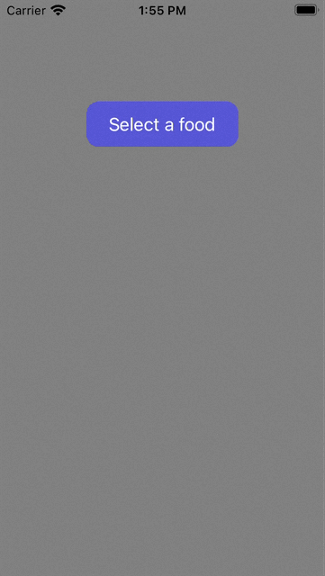

# Swift Drop Down Button

A easy to use drop down button written in Swift.



## Installation

### Cocoapods
1. Add `pod 'DropDownButton', :git => 'https://github.com/lamnguynn/DropDownButton.git', :tag => '1.0.3' ` to your *Podfile*. 
2. Install the pod(s) by running `pod install`.
3. Add `import DropDownButton` in the .swift files where you want to use it

## Basic Usage
After installing, it works similar to a UIButton where you will create the object and then assign whatever property is needed such as the title and any colors.

```swift
let dataSource = ["Hello", "World"]
let dropDownButton = DropDownButton(dataSource: dataSource)
self.view.addSubview(dropDownButton)
dropDownButton.setTitle("Select a category", for: .normal)
dropDownButton.setTitleColor(.white, for: .highlighted)
dropDownButton.backgroundColor = UIColor(red: 32/255, green: 118/255, blue: 128/255, alpha: 1)
dropDownButton.layer.cornerRadius = 12
```

Then you can set constraints programmatically just like a UIButton

```swift
dropDownButton.translatesAutoresizingMaskIntoConstraints = false
dropDownButton.topAnchor.constraint(equalTo: self.view.topAnchor).isActive = true
dropDownButton.heightAnchor.constraint(equalToConstant: 47.5).isActive = true
dropDownButton.leadingAnchor.constraint(equalTo: self.view.leadingAnchor, constant: 10).isActive = true
dropDownButton.trailingAnchor.constraint(equalTo: self.view.trailingAnchor, constant: -10).isActive = true
```

To be able to set the dataSource, simply just call it and set:

```swift
dataSource = ["Apples", "Oranges"]
dropDownButton.dataSource = dataSource
```

Additionally, the drop-down will either drop down or up depending on the placement of the button, so no worries about the drop-down list going out of bounds.

## Protocols
There is one protocol to allow another view controller to get the indexPath of whatever option is click. To be able to use, simply subclass your current class with dropDownIndexPath and conform to the function.

 ```swift
 class homePageViewController: UIViewController, dropDownIndexPath{
    let dropDownButton = DropDownButton()
    ...
    
    override viewDidLoad(){
        super.viewDidLoad()
        
        dropDownButton.dropView?.delegate = self
    }
    
    func dropDownClicked(indexPath: IndexPath){
        //Do something with indexPath
    }
 }
 ```
 
## Customization Properties
You can customize the drop-down via the following properties:

Drop-Down Menu Appearance
* `heightOfDropDown`: Height of the drop-down menu. 
* `dropDownColor`: Color of the drop-down menu
* `dropDownTextColor`: Color of the drop-down menu text
* `dropDownTextSize`: Size of the drop-down menu text
* `dropDownCornerRadius`: Corner radius of the drop-down menu

Drop-Down Menu Showing Animation
* `showMenuAnimationSpeed`: Value for the animation time when showing the drop-down menu
* `showMenuAnimationDelay`: Value for the animation delay when showing the drop-down menu
* `showMenuAnimationUsingSpringWithDamping`: Value for how intense the spring's oscillation will be when showing the drop-down menu. Values closer to zero will have a higher oscillation.
* `showMenuAnimationInitialSpringVelocity`: Value for the initial spring velocity when showing the drop-down menu. Higher values will give the spring more initial momentum.

Drop-Down Menu Hiding Animation
* `hideMenuAnimationSpeed`: Value for the animation time when hiding the drop-down menu
* `hideMenuAnimationDelay`: Value for the animation delay when hiding the drop-down menu
* `hideMenuAnimationUsingSpringWithDamping`: Value for how intense the spring's oscillation will be when hiding the drop-down menu. Values closer to zero will have a higher oscillation.
* `hideMenuAnimationInitialSpringVelocity`: Value for the initial spring velocity when hiding the drop-down menu. Higher values will give the spring more initial momentum.

## Button Label Font Sizing Issues
If you decide to make the button small and the text cuts out due to width issues. No worries, you can treat the problem similar to other labels. Just set the `adjustsFontSizeToFitWidth` property of the label to true, and change `minimumScaleFactor` property of the label to a value. Additionally, you can set insets to add some padding; view example below:

```swift
dropDownButton.titleLabel?.adjustsFontSizeToFitWidth = true                         //Sets the auto-sizing font of the label on
dropDownButton.titleEdgeInsets = UIEdgeInsets(top: 0, left: 5, bottom: 0, right: 5) //Sets padding on the left and right side of the label
dropDownButton.titleLabel?.minimumScaleFactor = 0.3                                 //Sets the minimum scale factor of the label
```

Additionally, you can set the `dropDownTextSize` property of the button to manually change the size of the text.

## Updates
-  `08/14/2021`: Added some new customization properties, and fixed minor bugs with the button.
-  `08/13/2021`: Made it easier to customize the drop-down menu via new properties added to the class. Added markup documentation to public variables and functions. 

## Lessons Learned
- Ability to markup certain variables or functions to allow for greater documentation when creating custom classes. Quite simple to use but very powerful. 
- Practice to be able to build custom assets instead of being handed them via Cocoapods or Apple.
- Creating an application for public use. What this means is not making something in general, it is thinking about what kinds of things other developers will be able to access or not, and making it clean and simple to use.
